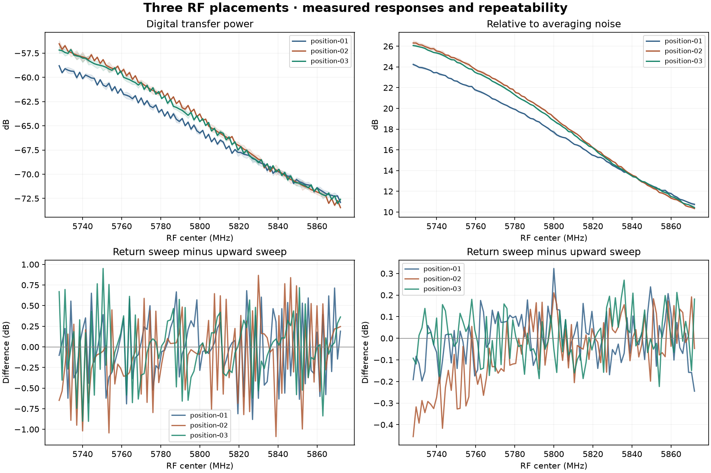
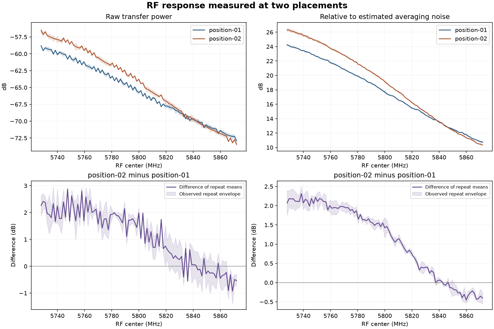
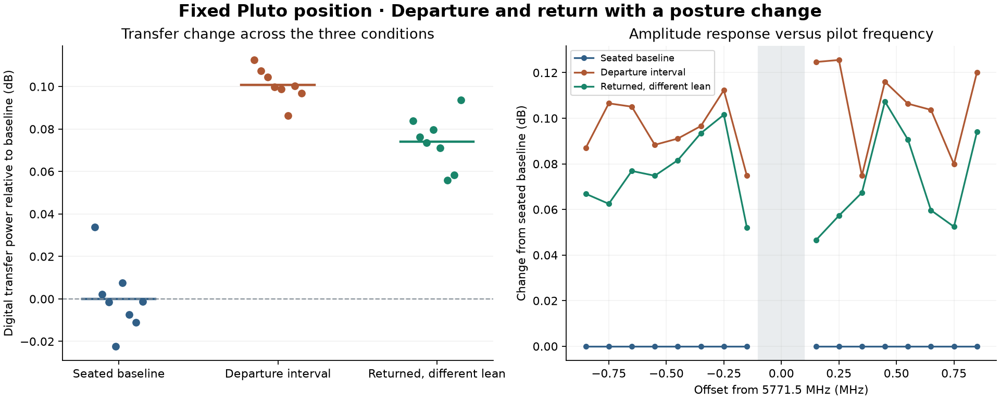
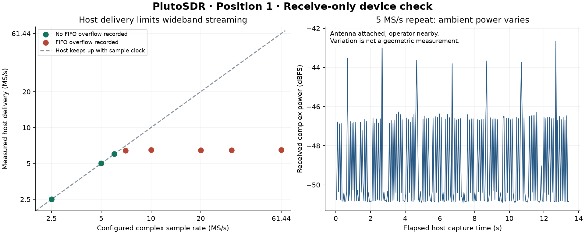

# RF room mapping experiments

Reproducible experiments with one ADALM-PlutoSDR and its supplied TX/RX antennas.
The objective is to investigate which room properties can be inferred from RF
measurements, starting at one fixed desk position and adding two blind placements.

## Latest: all three positions collected and verified

[Read the three-position report](reports/three-position-experiment/report.md).

- All three spots have both 97-center frequency sweeps and all three reference
  trains. The bundles retain 722 pilot bursts and 2,441 raw captures: **8.09 GB**
  of verified raw capture data, including two partial-control bursts at spot 1.
- The final spot completed in about 21 minutes. TX mute and restored RX settings
  were verified before releasing the operator. Physical collection is complete.
- Locations and heights remain unknown. Spot 3 was reported 30–60 degrees
  counterclockwise from spot 1; spot 2 was reported roughly 140–220 degrees rotated.
- A phase correction fitted at spot 1 reduced the median overlap inconsistency
  at both other spots from about 6.2 to 0.27 degrees. Absolute delay is still
  uncalibrated, and some individual overlap fits have large residuals.
- The power-ripple method recovers a simulated echo but also accepts a smooth
  no-echo control. That failure is preserved: **no wall ranges, placement
  coordinates or room map are validated**.
- All 35 numerical and acquisition-control tests pass. Raw complex samples stay
  local; public metadata, hashes, source snapshots and reports are committed.



[Final spot bundle](reports/2026-09-05T232905Z_position-03/bundle.md) ·
[Phase correction check](reports/phase-shape-three-positions/phase-shape.json) ·
[Power inference and failed control](docs/magnitude-inference.md).

## Position 2 complete; blind placement comparison saved

[Read the position 2 bundle](reports/2026-09-05T225813Z_position-02/bundle.md)
and [the comparison with position 1](reports/positions-01-02/report.md).

- All 97 frequency centers were captured in both directions, followed by all
  three seven-burst reference trains: 240 pilot bursts and 812 raw captures.
- About 2.69 GB of raw capture data passed verification. TX was muted and RX
  restored; a separate final device readback confirmed the mute before relocation.
- The operator reported roughly 140–220 degrees of SDR rotation. Position and
  height were not supplied, by request, and remain unknown for blind inference.
- The median power difference from position 1 was +1.423 dB. The change varies
  across frequency; it cannot be attributed solely to location.
- Within-position sweep differences remain significant: 0.323 dB median absolute
  difference and 0.903 dB at the 95th percentile. Raw values and warnings remain.
- All 30 tests pass. New offline tools compare placements, summarize bundles and
  test three-window phase consistency. No room geometry has been validated.



## Position 1 complete

[Read the complete position bundle](reports/2026-09-05T221649Z_position-01/bundle.md)
and [the reusable collection protocol](docs/position-protocol.md).

- Both sweeps cover all 97 planned frequency centers, with raw complex samples,
  channel estimates, passive context, reference repeats and TX-off controls saved.
- All three reference trains have seven completed bursts. Their fixed-frequency
  power standard deviations were 0.015, 0.043 and 0.049 dB.
- The bundle contains 242 RF bursts, including two retained partial-control
  bursts. About 2.71 GB of raw capture data passed hash and integrity checks.
- Retuned measurements vary more than held-frequency measurements. This limits
  interpretation of small scene changes; no room geometry has been inferred.
- Windows metadata-lock recovery, exclusion guards, raw-data verification and
  a single-command per-position workflow are implemented. All 25 tests pass.
- TX was muted and RX restored before the position 2 move cue.

The reusable collection command used for position 2 was:

```powershell
python scripts/collect_position.py --position-id position-02 --note "Position and antenna geometry description" --execute
```

Without `--execute`, this command only prints the plan. Raw samples and device
identity remain local under ignored `data/local/`; the repository contains
sanitized metadata, exact source snapshots and reports.

## Position 1 departure and return test

[Read the scene-change report](reports/2026-09-06-scene-change/report.md).

- Eight pilot bursts in each condition: seated baseline, instructed departure
  interval, then returned to the seat. Equipment remained at the same desk position.
- Transfer rose 0.101 dB during the departure interval, about 2.35% in pilot power.
  After returning it remained 0.074 dB above baseline, recovering only 27% of the shift.
- The operator reported a different lean after returning. This pose mismatch,
  incomplete recovery and unmeasured drift make the presence effect inconclusive.
- All 24 bursts completed without recorded clipping or FIFO overflow. Total
  commanded TX-unmute time was 9.15 seconds; TX was muted and RX settings restored.
- Raw IQ, exact acquisition sources, hashes, timing and the posture deviation are
  preserved. No wall ranges, bearings or floor plan have been inferred.



## Position 1 preflight

[Read the spectrum, sample-integrity and duplex report](reports/2026-09-06-preflight/report.md).

- RX-internal PRBS checked 33.6 million samples at 5 MS/s without a sequence error;
  the 7 MS/s overload control detected three buffer-boundary skips.
- Repeated passive sweeps found strong 2.4 GHz activity. A seemingly quiet
  2475.5 MHz interval showed bursts on a longer listen and was excluded.
- The monitored 5771.5 and 5853.1 MHz windows showed no comparable excess activity
  during the finite observations. That is not proof of permanent vacancy.
- Seven highly attenuated pilot bursts at 5771.5 MHz used about 2.7 seconds of
  commanded RF-on time. Four repeats at 45 dB TX attenuation produced clear
  matches, without clipping or FIFO overflow. TX is muted again.
- Timing offsets changed after stream restarts. Each subsequent measurement needs
  a reference; the pilot's 1.8 MHz span cannot resolve room-scale reflections.

The nearby computer, router and possibly moving operator are recorded as part of
the setup. No room geometry has been inferred from these preflight measurements.

## Initial device check (5 September 2026)

[Read the measured report](reports/2026-09-05-device-check/report.md).

- Pluto is reachable over its USB network interface; firmware v0.32, AD9364 profile.
- 5 MS/s is the conservative host-streaming rate for the next experiments: a
  13.4-second repeat completed without recorded FIFO overflow. A short 6 MS/s run
  also passed; 7 MS/s and higher tested rates overflowed.
- The receiver accepted a 56 MHz filter setting, but the host cannot continuously
  receive that full bandwidth at its required sample rate. Configured bandwidth
  has not been calibrated with an RF source.
- All 14 conditions returned their requested buffers. No digital rail clipping or
  out-of-format samples were observed. This does not certify analog linearity or
  perfect sample continuity.
- RX settings were restored. TX remains muted: oscillator powered down, attenuation
  at −89.75 dB, DDS disabled and zeroed. No transmit waveform was generated during
  this initial receive-only stage.



The operator was sitting near the attached antennas and could move during capture.
Ambient changes cannot be interpreted as a stationary room response. This stage
does not measure range or bearing and does not produce a floor plan.

## Run the characterization

Use Python 3.12, a system installation of libiio 0.x, and the packages in
`requirements.txt`. This was tested with libiio 0.26 / pylibiio 0.25 on Windows.

```powershell
python -m pip install -r requirements.txt
python -m unittest discover -s tests -v
python scripts/characterize_rx.py --suite smoke
python scripts/characterize_rx.py --suite full
python scripts/characterize_rx.py --suite threshold
```

The default URI is `ip:192.168.2.1`; `--uri` overrides it. The default RX center is
2.400 GHz; `--lo` changes only the receive center. Do not run this while another
application owns the SDR. No firmware, boot variables, reference clock selection,
or persistent device configuration is changed.

Each suite logs requested/readback settings, software identity, host buffer timing,
RX FIFO overflow, per-buffer IQ metrics, power spectra, source hashes and raw-data
hashes. A `finally` block restores RX settings and keeps TX muted. Interrupted or
failed conditions must be inspected in the results; a returned buffer alone does
not certify continuous sampling. The exit status reports software/capture failures,
not expected overflow at deliberately excessive rates.

## Records and next measurements

- `experiments/`: sanitized observations, manifests and exact capture source.
- `data/local/`: ignored raw IQ, SigMF sidecars and private context/serial records.
- `scripts/`: receive capture, internal PRBS, guarded per-position RF acquisition,
  fixed-frequency controls and offline verification.
- `tests/`: signal processing, exclusion guards, recovery and coverage checks.
- `reports/`: generated scientific plots and interpretations.

All three requested placements are complete; no fourth position is planned.
Further models can use the saved raw data offline. A quiet receive trace is not sufficient evidence
that a transmit frequency is suitable. The user's exclusions of cellular, GNSS
and occupied spectrum continue to apply.

Additional receive-only checks can be reproduced with:

```powershell
python scripts/check_prbs.py
python scripts/survey_spectrum.py
python scripts/survey_spectrum.py --monitor 5771.5 5853.1 2475.5
python scripts/verify_tx_off.py
```

`check_duplex.py` transmits short cyclic-pilot bursts at the fixed 5771.5 MHz
center after a fresh receive guard check. It enforces at least 45 dB hardware
attenuation, digital backoff, a separate-context mute timer and final cleanup.
It was used under the user's laboratory authorization; its recorded settings do
not constitute a radiated-power calibration or general frequency authorization.

`scene_change.py` uses the same fixed pilot and bounded bursts for three stages,
muting TX while it waits for `B` and `C` on stdin. A controller command starts a
stage; human replies and cue timing must be logged separately. The script stops
and restores settings on EOF, unexpected input or a five-minute input timeout.
`report_scene.py` analyzes the saved results without accessing the SDR.

Several separated quiet frequency intervals cannot automatically be combined into
one coherent wideband measurement. Retuning phase, timing, hardware response and
scene motion need to be measured before interpreting a synthetic delay profile.

A single fixed pair provides no independent bearing. Any future inferred geometry
must state its assumptions and uncertainty, and should be checked using additional
known positions or controlled targets.
