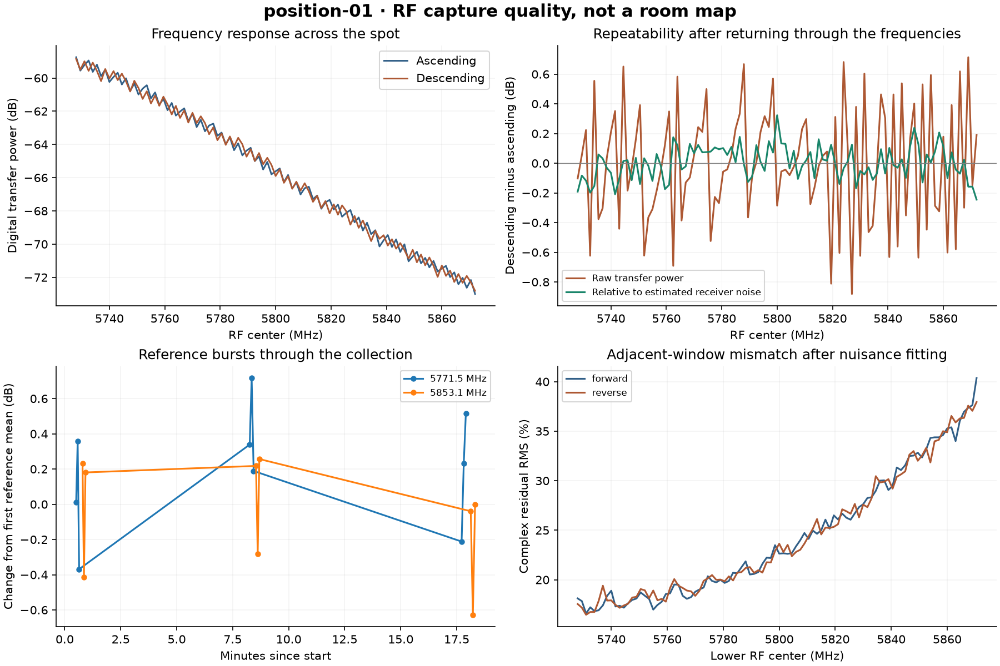

# Position 1: collection complete, ready for relocation

The planned frequency sweeps and reference controls have been captured and
verified. TX was muted and RX settings restored before the move cue. The operator
confirmed that the equipment stayed fixed and they stayed in place during the
main capture. Coordinates, height and antenna orientation remain unmeasured.

The accepted bundle contains 242 RF bursts: 219 main measurements, 21 completed
held-reference measurements and two additional bursts from a partial reference
train retained for audit. Its 817 raw files total 2,705,326,080 bytes (2.52 GiB),
with 242 associated complex-channel files. Hashes, sample format, FIFO status,
clipping, pilot evidence, negative controls and final device state were checked.
An additional receive-only check after all controls also found no significant
pilot match and verified the final TX mute.

## Repeatability and the next inference step

The main capture contains ascending and descending measurements at every one of
the 97 planned centers from 5728 to 5872 MHz. Their absolute power differences
have median 0.304 dB and 95th percentile 0.670 dB. Relative to the within-burst
estimated receiver noise, these become 0.085 and 0.200 dB. Both statistics remain
available; normalization is a diagnostic, not independent calibration.

Follow-up controls kept frequency and filter settings unchanged between bursts:

| Reference center | Completed bursts | Power standard deviation |
|---|---:|---:|
| 5771.5 MHz | 7 | 0.0148 dB |
| 5800.0 MHz | 7 | 0.0435 dB |
| 5853.1 MHz | 7 | 0.0490 dB |

The lower within-train variation is consistent with reconfiguration contributing
to the sweep variation. The controls were later, over shorter intervals, so they
do not isolate reconfiguration from time-dependent drift. Small differences
between future positions must be compared with this instrumental variability.
The sweep warning is retained and does not invalidate the recorded raw samples.

Overlapping windows still show appreciable complex-response mismatch after
fitting scale, common phase and linear phase. These data do not establish a
coherent wideband delay measurement. No wall ranges, bearings or floor plan are
claimed. Additional positions supply comparisons, but random placement without
coordinates also leaves geometric ambiguity.

## Deviations retained with the data

1. The first survey's activity mask included a receiver-edge rise. It rejected
   all RF centers and transmitted nothing. A nine-capture receive-only diagnostic
   motivated the narrower useful guard region and overlapping offset guards.
2. The next attempt completed its passive survey, then stopped on a libiio
   buffer-length API mismatch before transmitting. The corrected run reused that
   recent same-position survey with provenance preserved and fresh per-burst guards.
3. A Windows file-sharing lock interrupted the held controls after nine bursts.
   The completed seven-burst 5771.5 MHz train and its TX-off control were verified.
   Fresh complete trains at 5800 and 5853.1 MHz supplemented it. The interrupted
   run remains marked stopped; its partial 5800 MHz train is retained separately.
   The metadata writer now retries bounded sharing violations and preserves the
   previous and pending snapshots if the lock persists.

All failed attempts, their exact acquisition source and existing raw data remain
available locally. Public error text removes the absolute user directory; the
original is retained locally with its hash. The evidence rule for weak averaged
pilots is described in the [main review](report.md), including its limits.

## Reuse at subsequent positions

The [protocol](../../docs/position-protocol.md) defines the complete capture bundle,
guards, power settings, stop mechanism, recovery and verification. Preserve the
relative antenna spacing and orientation when moving the setup; record its
approximate height, orientation and distances to two identifiable walls when
possible. Wait for the next collection to finish and be reviewed before moving
again. The first main capture took about 19 minutes; completion is checked rather
than inferred from a fixed duration.

[Machine-readable bundle](../../experiments/2026-09-05T221649Z_position-01/bundle.json)
· [Experiment manifest](../../experiments/EXP-2026-09-06-004.json)
· [Position registry](../../experiments/positions.json)
