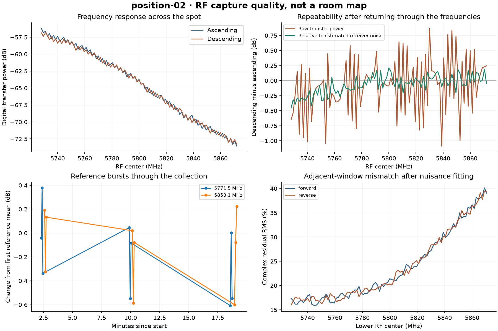

# position-02: complete RF bundle review

Operator placed setup at spot 2. Reported SDR rotation approximately 140-220 degrees relative to spot 1; axis and direction unspecified. Position, height and antenna geometry unmeasured. Combined position-and-orientation comparison.

Acquisition ready to move: **True**. Geometry inference remains **unvalidated**.

The main and reference-control stages saved **240 pilot bursts** and **812 raw captures**, totaling **2,690,646,016 bytes**. The recorded reviews verify hashes, sample integrity, pilot evidence, negative controls, required coverage and final state.

All stages verified final TX mute: **True**. Restore errors: []. Total commanded unmute interval: 91.990 seconds.

Raw IQ, TX samples, complex channel estimates and private context are retained locally. The public record contains source snapshots, settings, hashes, quality metrics and annotations.

## Coverage and repeatability

Paired ascending/descending frequency centers: **97 / 97**. Median absolute power difference: **0.3232 dB**; 95th percentile: **0.9026 dB**.

The following reference trains held frequency and filter settings fixed between seven bursts:

| Center | Bursts | Power standard deviation |
|---|---:|---:|
| 5771.5 MHz | 7 | 0.0388 dB |
| 5800.0 MHz | 7 | 0.0877 dB |
| 5853.1 MHz | 7 | 0.0408 dB |

Warnings and deviations remain part of the record:

- 95th percentile forward/reverse power change exceeds 0.5 dB.

The raw power differences and control variability describe technical repeats. They do not isolate instrument drift, operator changes, position or orientation effects. The noise-relative statistic and attenuation controls are detailed in the [main review](report.md).

## Temperature metadata

Median pilot temperature readback: 37.719 C. 2 readbacks differed from this median by more than 8 C. These values remain unchanged in the original data and are flagged in bundle-summary.json. No temperature-based correction was applied.

## Interpretation and retained evidence

Coordinates and height remain unknown where no ground truth was supplied. The RF data are preserved for blind inference, with unknown antenna geometry, instrumental response and capture phase treated explicitly. Acquisition completion does not establish a room map.

[Machine-readable bundle](../../experiments/2026-09-05T225813Z_position-02/bundle.json) · [Operator annotations](../../experiments/2026-09-05T225813Z_position-02/operator-events.json) · [Collection protocol](../../docs/position-protocol.md)

[Comparison with position 1](../positions-01-02/report.md) · [Three-window consistency data](closure/closure.json) · [Phase inference notes](../../docs/phase-inference-notes.md)
