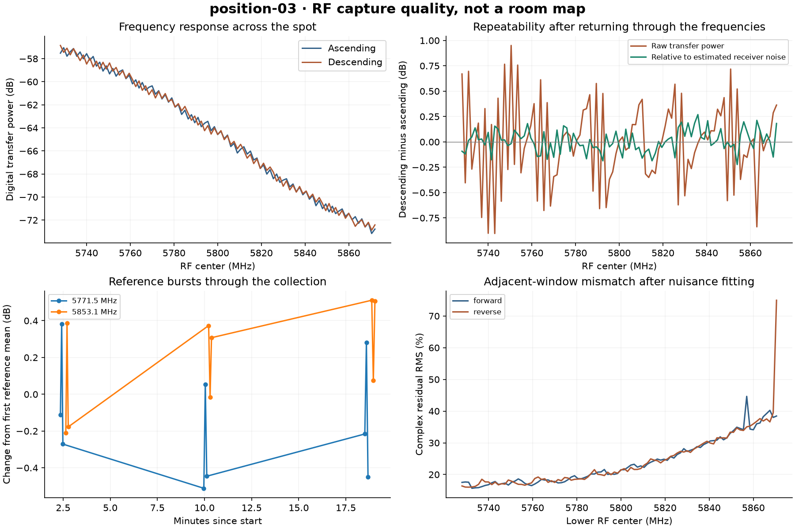

# position-03: RF collection review

Run `2026-09-05T232905Z_position-03`. Third and final operator-chosen spot. SDR rotated approximately 30-60 degrees counterclockwise relative to spot 1, as described by imagining spot 1 turning counterclockwise. Location and height withheld for blind RF inference; antenna geometry unmeasured.

Operator authorized collection at the third and final spot. Instructed to keep equipment fixed until completion and verification. Exact operator posture or movement is not independently measured.

Acquisition ready to move: **True**. Mapping ready: **False**.

Paired frequency centers: 97 / 97. RF bursts: 219. Total commanded TX-unmute interval: 84.196 seconds.

Verified raw captures: 764, totalling 2,539,651,072 bytes. Final TX mute: True. Restore errors: [].

## Checks before moving

- Review note: 95th percentile forward/reverse power change exceeds 0.5 dB.
- No acquisition blockers found.

Absolute ascending/descending transfer-power difference: median 0.3052 dB; 95th percentile 0.7590 dB.

For the averaged signal/noise statistic, the corresponding differences are 0.0767 dB and 0.1953 dB. This divides by within-burst estimated averaging noise; it can reduce common gain variation but is not an independent calibration. Channel motion can also enter the variance estimate. Both original power and this diagnostic are retained.

| Control | Measured change | Expected |
|---|---:|---:|
| start, 5771.5 MHz | -2.818 dB | -3 dB |
| start, 5853.1 MHz | -2.581 dB | -3 dB |
| end, 5771.5 MHz | -2.796 dB | -3 dB |
| end, 5853.1 MHz | -3.277 dB | -3 dB |

## What is retained

Raw TX-off/ambient IQ; deterministic narrow and wide pilot waveforms; raw IQ for every pilot burst; per-bin complex channel means, variance and quarter-burst means; temperatures, gain, bandwidth, frequencies, timing, clipping/overflow checks; exact capture sources and SHA-256 hashes. These permit later analyses without relying only on averaged power.

The 3.6 MHz pilot windows overlap on a 1.5 MHz tuning grid. Each RF burst is preceded by two RX-only guards at offsets of -0.6 and +0.6 MHz, using a 3 MHz RX filter and the central +/-1.45 MHz. This avoids the measured receiver-edge rise and covers both RX DC gaps. Observed occupied intervals are skipped, not filled with transmitted data.

## Interpretation limits

Each tuning has an arbitrary capture delay and carrier phase. Overlap diagnostics fit scale, common phase and linear phase; a small residual does not prove global phase coherence or identify absolute wall range. The guard procedure retunes RX and changes filter bandwidth before each RF burst; calibration continuity is not assumed. Frequency response includes both radio/antenna response and unresolved room paths. Operator motion, cables and antenna pose can also change it.

The paired sweeps and reference returns are technical repeats within one collection. They do not by themselves distinguish instrumental drift from scene change. Position coordinates and antenna orientation require operator records or a separately validated estimation method.

The original conservative per-period correlation flag remains in every capture. 69 captures below that flag still passed the separate averaged-response evidence rule: correlation above max(0.06, 2.5 times the TX-off reference), averaging noise/signal ratio below 0.25, and phase residual RMS below 15 degrees. Synthetic weak-pilot and pure-noise cases check this distinction. Passing establishes measurable averaged pilot content, not precise phase in every frequency bin.

[Acquisition metadata](../../experiments/2026-09-05T232905Z_position-03/results.json) · [Detailed verification and diagnostics](../../experiments/2026-09-05T232905Z_position-03/review.json)
