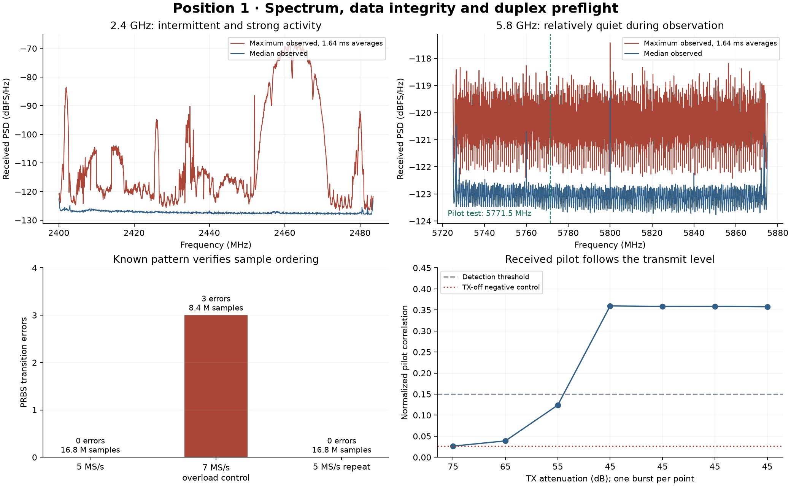

# Position 1 preflight

Local dates: 5–6 September 2026 (Asia/Jerusalem). Run identifiers use UTC. Asset: RFL-SDR-001.

The receive data path and a brief low-level full-duplex coded-pilot measurement work at this desk position. A usable next measurement can now include a timing reference. These checks do not establish a floor plan or calibrated range.

## Setup and observations

The supplied TX/RX antennas remained attached. The user reported sitting near the SDR, possibly moving or leaving, with the SDR near the computer and a few feet from a router. Distances, antenna orientation and movement times were not measured. The host reported a 5 GHz channel-36 Wi-Fi association; this does not identify every nearby transmitter. SSID, BSSID and the hardware serial are not published.

## Sample ordering

The internal AD936x PRBS generator was injected into the RX digital port, with TX muted and RF loopback disabled. Two 5 MS/s captures each contained 16,777,216 complex samples with zero I/Q overlap errors and zero invalid sequence transitions, including buffer boundaries. The 7 MS/s overload control contained three sequence skips, all at buffer boundaries, and asserted the RX FIFO overflow flag.

This is stronger evidence than delivery timing alone. It tests the digital path from the PRBS injection point through the FPGA and host, not the analog receiver. The pattern has 65,535 states, so loss of an exact whole period can be invisible. The alternative I/Q reversal and recurrence-direction representations are equivalent; the selected software reconstruction is not independent proof of analog I/Q polarity.

## Spectrum survey

Three passes covered 2400–2483.5 MHz and 5725–5875 MHz, using 234 main tuning dwells of approximately 105 ms each at 5 MS/s, manual gain 40 dB, a 4 MHz RX filter, and the central 3 MHz for spectral analysis. Two clipped 2.4 GHz dwells were repeated at 20 dB gain. All 236 dwells completed without recorded FIFO overflow.

The 2.4 GHz region contained strong and intermittent signals. The clipped centers were about 2461.5 and 2462.5 MHz; the lower-gain repeats did not clip. A relatively quiet sweep candidate at 2475.5 MHz showed bursts on a subsequent 10.07-second dwell and was excluded from the pilot test.

| Fixed RX center | Dwell | Peak excess over its median PSD | Result |
|---|---:|---:|---|
| 5771.5000 MHz | 10.07 s | 5.14 dB | No comparable excess detected |
| 5853.1000 MHz | 10.07 s | 4.91 dB | No comparable excess detected |
| 2475.5000 MHz | 10.07 s | 16.56 dB | Bursts; excluded |

The 5.8 GHz observations are a finite local survey, not proof of permanently empty spectrum. PSD is relative to digital full scale, not calibrated RF power. Hidden receivers, weak signals, intermittent transmissions, antenna response and receiver compression remain limitations. The 20th-percentile band reference used for ranking is not a calibrated noise floor.

## Low-level duplex and timing check

A fresh receive-only guard check preceded the transmission. The pilot used a 5771.5 MHz center and a 1.8 MHz nominal frequency span, with a DC notch. A deterministic 4096-sample periodic code was sent from a small cyclic DMA buffer. Each burst was guarded by a separate-context 0.8-second TX-mute timer and ended normally before that timer fired.

There were 7 RF bursts, each approximately 0.38–0.40 seconds, totalling 2.707 seconds of host-measured commanded unmute intervals. Hardware TX attenuation progressed from 75 to 45 dB; digital complex power was -21.52 dBFS relative to 32768. No amplifier was used. Radiated power and unwanted emissions were not measured, so these settings are not an EIRP calibration.

| Burst | TX attenuation | Median correlation | Detection |
|---|---:|---:|---|
| burst1_gain75 | 75 dB | 0.0265 | Below conservative threshold |
| burst2_gain65 | 65 dB | 0.0389 | Below conservative threshold |
| burst3_gain55 | 55 dB | 0.1239 | Below conservative threshold |
| burst4_gain45 | 45 dB | 0.3595 | Yes |
| burst5_gain45 | 45 dB | 0.3584 | Yes |
| burst6_gain45 | 45 dB | 0.3586 | Yes |
| burst7_gain45 | 45 dB | 0.3576 | Yes |

The four 45 dB attenuation captures repeated at correlation 0.358–0.360, compared with 0.0264 before TX and 0.0262 in the subsequent TX-off control. No digital clipping or RX FIFO overflow occurred. Within each detected burst, residual phase variation after a linear fit was approximately 1.05–1.14 degrees RMS. This does not certify coherence across retunes or restarts.

The detected correlation peak was localized to adjacent sample bins within each burst, but moved between 1273/1274, 2758/2759, 2163/2164 and 3710/3711 across stream restarts. Those offsets include arbitrary acquisition timing. They must not be multiplied by propagation speed and interpreted as wall ranges. A reference and alignment step are required for each capture.

The received pilot can include direct antenna coupling, coupling inside the device and room multipath. This test does not separate them. Its approximately 1.8 MHz span gives conventional near-monostatic range resolution of roughly 83 m, much coarser than a room. Wider calibrated measurements, stronger scene assumptions or additional measured positions are needed for useful geometry; even 56 MHz corresponds to roughly 2.7 m conventional range resolution.

## End state and next experiment

TX is muted: TX LO powered down, maximum attenuation restored, DDS zeroed/disabled, and cyclic TX buffers destroyed. RX settings were restored and BIST/loopback were off. A separate RX-only negative control confirmed disappearance of the pilot. Final RF-chip telemetry was 35.1 °C.

The next position-1 experiment should measure a repeatable channel response with an in-capture reference and a controlled scene change. Report direct coupling and unresolved multipath explicitly. Do not infer a room outline from a single stationary omnidirectional pair, and do not coherently combine separated frequency windows until retune phase and hardware response have been calibrated.

One initial calibration attempt failed before TX unmute because libiio required a mutable bytearray. The corrected attempt succeeded; the failed attempt and its note are retained. No RF burst was started by that failed attempt.

## Reproducibility

Raw IQ, pilot samples and SigMF sidecars remain in ignored `data/local/`. Public records contain requested/readback settings, timing, statistics, source hashes and data hashes. Exact capture sources are preserved beside each run. Synthetic checks cover PRBS errors and missing samples, pilot delay/frequency recovery, false detection on noise, digital level/bandwidth and spectrum frequency sign.

Records:

- [2026-09-05T205624Z_rx-prbs](../../experiments/2026-09-05T205624Z_rx-prbs/results.json)
- [2026-09-05T205753Z_survey](../../experiments/2026-09-05T205753Z_survey/results.json)
- [2026-09-05T210028Z_monitor](../../experiments/2026-09-05T210028Z_monitor/results.json)
- [2026-09-05T210345Z_duplex-calibration](../../experiments/2026-09-05T210345Z_duplex-calibration/results.json)
- [2026-09-05T210519Z_tx-off-control](../../experiments/2026-09-05T210519Z_tx-off-control/results.json)

Technical references: [ADI BIST description](https://analogdevicesinc.github.io/documentation/solutions/reference-designs/fmcomms2/software/ad9361_adv_plugin.html), [ADI PRBS reference](https://github.com/analogdevicesinc/hdl/blob/hdl_2019_r2/library/axi_ad9361/axi_ad9361_rx_pnmon.v), [supplied antenna measurements](https://wiki.analog.com/university/tools/pluto/users/antennas), [range-resolution relationship](https://www.analog.com/en/resources/technical-articles/how-to-build-a-24-ghz-fmcw-radar-system.html).
