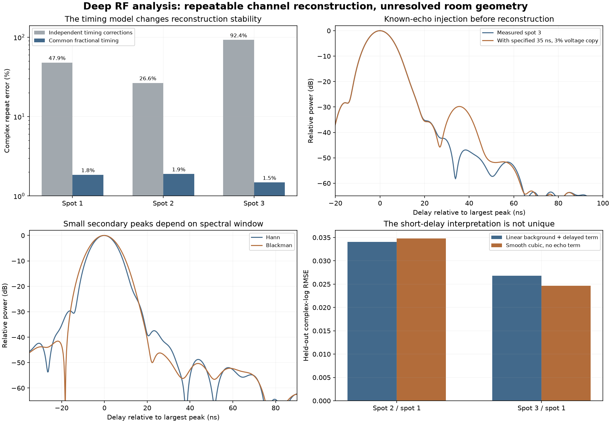

# Deep RF pass: a repeatable wideband response, but no verified room map

The deeper pass recovered useful information that the initial review left unresolved. After modeling a known waveform-mirror component and using approximately common fractional sample timing, the two independent sweeps agree to **1.5–1.9% in complex response**. A weak short-delay-like change appears between spot 1 and the later spots, but it is not uniquely identified as a reflection.

**Physical collection is complete. This pass used saved data only; no SDR connection or transmission was made. Original IQ, acquisition metadata and earlier analyses remain preserved.**



## What was recovered

The analysis fits all **582 sweep pilots** and **117 accepted reference pilots**. Eighteen representative captures were recomputed directly from their original, hash-verified IQ; the complex estimates matched the saved arrays exactly. Separately fitted halves of those bursts had a median 0.57-degree phase RMS difference after removing an overall affine phase. This tests short-term repeatability, not absolute ranging.

A small response component follows the exact conjugate-mirror pattern of the transmitted pilot. It is about **26 dB below the desired component in power**. Modeling it reduces held-out-bin error by median 10.7%, 11.7% and 12.8% at spots 1, 2 and 3; residual variance is close to the recorded averaging-noise estimate. Known-mirror and no-mirror synthetic controls check that this is not simply an extra curve fit. The analysis does not identify which physical radio stage creates the mirror term.

Each narrowband response is then represented by smooth complex polynomials. Adjacent windows observe overlapping RF frequencies, allowing the shared baseband curvature to be estimated from their ratios. The filter model is trained on **spot 1’s forward sweep only** and applied unchanged to all six sweeps. Constant phase and gain changes between windows remain free.

| Position | Repeat error with independent timing corrections | Repeat error with common fractional timing |
|---|---:|---:|
| position-01 | 47.86% | 1.85% |
| position-02 | 26.58% | 1.89% |
| position-03 | 92.40% | 1.48% |

These errors compare full complex responses after removing one overall complex scale and linear phase; they are **not distance errors**. Both columns use the same frozen filter calibration. Allowing an independent delay correction at every window amplified local slope noise into unstable wideband phase. The timing constraint greatly improves independent-sweep agreement. A separate control using the earlier median-derived filter also gives roughly 1.5–1.9% errors with common timing, isolating the timing-model effect from the change in filter estimation.

Reference trains show within-center scatter of roughly 0.5–2.4 ns in fitted local phase-slope equivalents, including estimator noise and possible filter variation. The model therefore assumes approximate common fractional timing; it does not assert perfect clock or filter stability. Repeating the reconstruction with polynomial degrees 6 and 10 gives similar sweep agreement. Separate first and last quarters of each capture give approximately 2.8–4.0% sweep errors with the original filter calibration frozen.

## The candidate short-delay feature

Ratios between reconstructed placements cancel a shared radio response and the common quadratic-phase ambiguity of the unrestricted timing model. Their repeat errors are 4.15% for spot 2 / spot 1, 2.90% for spot 3 / spot 1, and 2.85% for spot 3 / spot 2, after overall scale/phase/delay alignment.

A weak delayed term plus a restricted smooth background fits a **roughly 5–8 ns** feature in both comparisons with spot 1. With a linear background, preferred delays are 6.0 and 5.5 ns and the fitted complex-log coefficient magnitude is about 0.06. The search was explicitly extended below the roughly 6.8 ns inverse-bandwidth interval; that interval is not treated as a prohibition on model-based estimation.

However, a smooth cubic complex-log model with no explicit echo predicts held-out data almost as well or better:

| Comparison | Linear background + delayed term | Smooth cubic, no echo term |
|---|---:|---:|
| position-02 / position-01 | 0.03407 | 0.03478 |
| position-03 / position-01 | 0.02678 | 0.02468 |

Entries are blocked cross-sweep prediction RMSE in complex log response, not calibrated likelihoods or confidence intervals. With the cubic background, adding a delay term worsens prediction and sweep-specific preferred delays disagree. Spot 3 / spot 2 has no delayed-term model that improves this blocked prediction check.

**Interpretation:** there is a repeatable broad response change associated with spot 1 versus the later acquisition states. A short reflected path is one possible model. Changed antenna coupling, radio response or other smooth effects remain competing explanations. If a 5–8 ns term were independently established as propagation delay, it would represent about 1.5–2.4 m of additional path, not a measured wall distance. This conditional conversion is not a room estimate.

## Are the methods capable of preserving an echo?

Yes, in the tested controls. Known simulated 35 ns and 85 ns paths survive overlap reconstruction with arbitrary constant capture phase/gain and a specified filter. In a separate channel-domain simulation, a 35 ns path at 5% voltage and an 80 ns path at 3% voltage were recovered in all six reconstructed sweeps for each of three timing-jitter settings: 0, 0.5 and 2 ns standard deviation. Noise levels follow the measured per-bin variance; these are six seeded scenarios, not a statistical certification.

The injection test adds a delayed copy of the estimated desired response to the observed spot 3 channels **before** mirror decomposition and overlap reconstruction. The measured residual noise remains present. At 3% and 10% voltage, the 20, 35, 60 and 100 ns injected copies create identifiable secondary maxima in both sweeps: 16 of 16 tested longer-delay cases. The 5 and 10 ns copies do not create separate maxima in these eight examples. This is a sensitivity test with known truth, not a universal detection bound.

The measured responses are dominated by one unresolved peak. Small secondary maxima change with the spectral window. Smooth no-reflection simulation controls also generate secondary peaks beyond 20 ns, reaching approximately -40, -36 and -31 dB for 0, 0.5 and 2 ns timing jitter. Consequently, small lobes in the measured delay plots cannot simply be labeled walls.

## What remains unknown

Absolute propagation delay, bearing, antenna geometry, placement coordinates and room dimensions remain uncalibrated. Rotating the antennas and changing position together confounds their effects. If independent per-window timing is allowed, an exact quadratic-phase ambiguity remains; the numerical test demonstrates it. Common timing is a useful, empirically supported constraint, not a replacement for geometric ground truth.

The saved RX settings and waveforms agree across the three main runs. Acquisition-source differences between spots 1 and 2 concern validation, logging and metadata persistence, rather than different RF settings. Extra clock/tracking readbacks were added after spot 1, so absent spot 1 values are not silently filled in.

The outcome is a stronger reusable RF analysis toolset and a repeatable effective channel, plus a qualified short-delay hypothesis. **No wall coordinates, room dimensions or floor plan have been validated.**

## Reproduce and inspect

Install requirements.txt, then run the scripts from the repository root. Raw files must remain at their recorded local paths. Use fresh output-directory names because reconstruction arrays are created exclusively.

```powershell
python -m unittest discover -s tests -v
python scripts/run_deep_stitch.py experiments/2026-09-05T221649Z_position-01/results.json experiments/2026-09-05T225813Z_position-02/results.json experiments/2026-09-05T232905Z_position-03/results.json --timing fixed --calibration overlap --out reports/deep-analysis/rerun-fixed
```

The report records software versions, input hashes and sensitivity results in [summary.json](summary.json). All 43 tests pass at this analysis checkpoint. Exact analysis sources are archived with the individual outputs; reconstructed complex arrays remain local with hashes.

- [Raw-IQ audit](raw-audit/raw-audit.json) and [all reference controls](reference-controls/reference-controls.json).
- [Mirror-component decomposition](image-full/image-diagnostic.json).
- [Primary reconstruction](stitch-fixed-degree8/stitch.json) and [six-sweep delay/phase plot](stitch-fixed-degree8/reconstruction.png).
- [Complex-ratio model comparison](differential-model-comparison/differential.json).
- [Known echoes injected into measured channels](injection-v2/injection.json).
- [Known-truth scenarios with measured noise levels](known-truth-v2/validation.json).
- [Original collection report](../three-position-experiment/report.md).

Two initial grid-coverage failures are retained under stitch-degree8 and stitch-degree8-r2. The final blend stays within captured pilot support and covers the DC notch despite LO rounding. The first injection report excluded the central 12 ns from its displayed-peak shortlist; injection-v2 instead checks actual secondary maxima at short delays. Known-truth-v2 extends the analytic truth grid to cover both reconstruction endpoints. Earlier results remain archived.

Manufacturer context: the AD936x has separate RF synthesizers and lacks automatic RF phase synchronization; its filters affect both magnitude and phase. This method estimates window phase discontinuities rather than assuming RF phase continuity. [Analog Devices hopping guidance](https://ez.analog.com/rf/wide-band-rf-transceivers/design-support/f/q-a/80380/ad9361-phase-coherent-hopping/150247), [Analog Devices filter documentation](https://wiki.analog.com/resources/eval/user-guides/ad9361).
